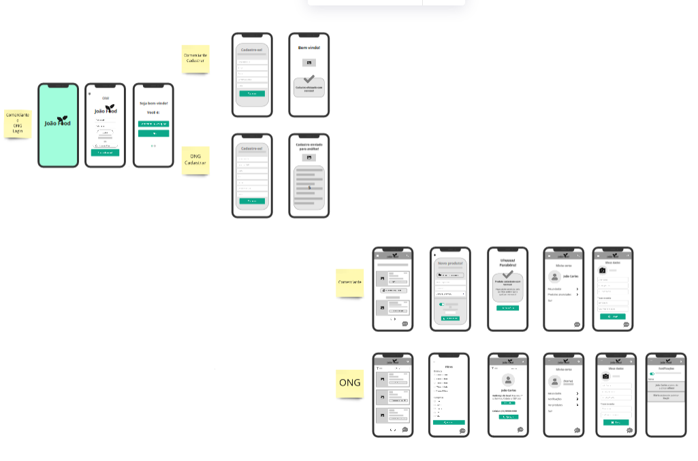

# Joao Delivery App: Fome Zero

Bem vindo ao [Joao Delivery](#https:/)!   

---

Conteúdo 

1. [Introdução](#introdução)
1. [O Problema](#o-problema)
1. [Oportunidade de Mercado](#oportunidade-de-mercado)
1. [Nossa Solução](#nossa-solução)
1. [Autores](#autores)
1. [License](#license)

---

## Introdução

O __Joao Delivery__ é um MVP desenvolvido para o __Call for Code Hackathon 2021__ com o objetivo de reduzir o desperdício de alimentos contribuindo assim para a redução da fome de uma parcela da população no Brasil.

---

## O Problema

820 milhões passam fone no mundo, 127 milhões de toneladas de alimentos são jodagas fora por ano na América latina, 41 mil toneladas de alimentos são jogadas fora por ano no Brasil. (por equanto só imformações soltas)

---

## Oportunidade de Mercado

Temos que pensar mais um pouco!!!!

---

## Nossa Solução

### Sistemática do aplicativo

1. Comerciante do centro de abastecimento anuncia que sobrou x kg de algum alimento, cadastra os alimentos no app e  anuncia se será de graça ou por um preço pequeno
2. É enviado uma notificação e e-mail para todas as ONGS 
3. A ONG vai até o comerciante e compra e recebe 
4. As pessoas recebem notificação e dizem se estão interessadas no produto por x preço
5. Depois de no mínimo x pessoas aceitarem, o motorista inicia a corrida
6. As pessoas veem pelo app o trajeto do caminhão
7. O caminhão passa na rua e a pessoa compra por um preço barato

### User Flow    

### Tecnologias Implementadas    

- Kotlin
- Flask
- Firebase

---

## Autores

* [Ana Valente](https://github.com/AnaVSSCaldeira)
* [Jack Tanaka](https://www.linkedin.com/in/jackeline-tanaka/)
* [Lucas Martins](https://github.com/lucaomartins/)
* [Marcus Mariano](https://github.com/marcusmariano)
* [Nicole Silveira Manoel](https://www.linkedin.com/in/nicole-silveira-manoel-b04b8b159/)

 
---

## License

Code and documentation are available according to the GNU GENERAL PUBLIC LICENSE Version 3 (see [LICENSE](https://www.gnu.org/licenses/gpl.html)).
